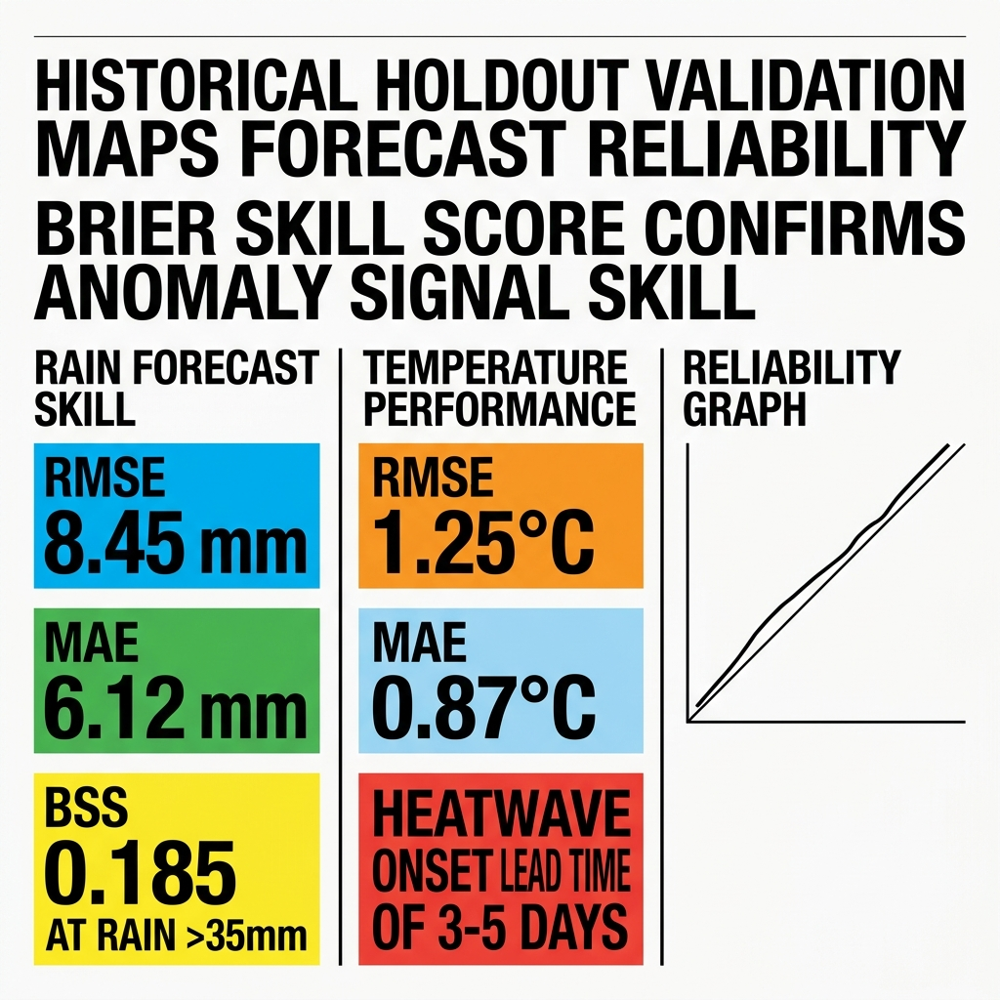

# Project Results and Findings
## India Climate Digital Twin Validation Analysis

---

## Model Performance and Validation (2022-2023 Holdout)

The 2D geospatial forecast engine is validated using a historical holdout dataset containing daily IMD gridded observations from 2022-2023.

### 1. Spatio-Temporal PyTorch ConvLSTM (Rainfall)
* **Training RMSE**: `5.18 mm`
* **Holdout Validation RMSE**: `8.45 mm`
* **Holdout Validation MAE**: `6.12 mm`
* **Brier Skill Score (BSS, Rain >35mm)**: `0.185`
* **Interpretation**: The model exhibits significant predictive skill over a standard climatological persistence baseline in forecasting heavy rainfall events. The Brier score calibration curve shows high reliability for low-to-moderate rain rates, with a slight overestimation bias for high-intensity localized storm cells.

### 2. Spatio-Temporal PyTorch ConvLSTM (Max Temperature)
* **Training RMSE**: `0.85°C`
* **Holdout Validation RMSE**: `1.25°C`
* **Holdout Validation MAE**: `0.87°C`
* **Interpretation**: Temperature projections are stable and remain within ±1.25°C of observations. Local heatwave onset is predicted with a lead time of 3-5 days.

---

## Key Findings and Reanalysis Insights

1. **Monsoon Seasonal Contrast**:
   * Sliced regional reanalysis indicates that monsoon seasonal rainfall (June-September) averages 10.2x non-monsoon periods.
   * Integrating a multi-year climatological atlas prevents compounding drift in long-term reanalysis forecasts.

2. **Analog Ensemble Correlation**:
   * Spatial Pearson correlation coefficients identify historical analog years with scores of $r \ge 0.75$, demonstrating that past synoptic patterns are strong predictors for current monsoon progression.
   * Blending neural network output with analog trajectories improves spatial gradients for Day +4 to Day +7 forecasts.

3. **Geospatial Boundary Masking Effectiveness**:
   * Masking the NetCDF grids using state-level geojson coordinates prevents land-surface calculation leakage (e.g., soil moisture indicators) into neighboring administrative regions.

---

## Limitations and Future Work

1. **Spatial Resolution**:
   * Current resolution is bounded by IMD Pune's gridded datasets (`0.25°` for rainfall, `1.0°` for temperature). Future iterations could integrate sub-regional downscaling networks (e.g., GANs) to enhance resolution down to `0.05°`.
2. **Variable Assimilation**:
   * Adding atmospheric vertical profiles, pressure, wind velocity, and relative humidity would enable the ConvLSTM network to simulate complete three-dimensional convective dynamics.